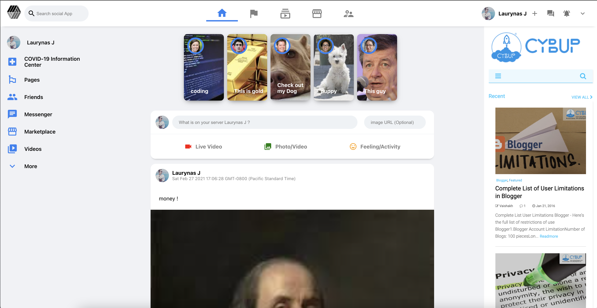

# This is Social App
  
  # Table of Contents
1. [Description](#description)
2. [Installation](#installation)
3. [Usage](#usage)
4. [Contributing](#contributing)
5. [Tests](#tests)
6. [License](#license)
7. [Questions](#questions)
## Description
* Login post and check out your friends posts on this site
## Installation
* clink on link and sign upmwith your google account
## Screenshot

## Usage
* Use it like all other social apps
## Contributing
* When contributing to this repository, please first discuss the change you wish to make via issue, email, or any other method with the owners of this repository before making a change. Please note we have a code of conduct, please follow it in all your interactions with the project.
## Tests
* No
## Link to deployed version of the app
* https://github.com/Juzva8/socialapp
* https://socialapp-a6247.web.app
## License
* A short and simple permissive license with conditions only requiring preservation of copyright and license notices. Licensed works, modifications, and larger works may be distributed under different terms and without source code.
## Questions
* Contact me at:
  * [My GitHub Profile](https://github.com/Juzva8)
  * My Email laurynas.juzva@gmail.com
